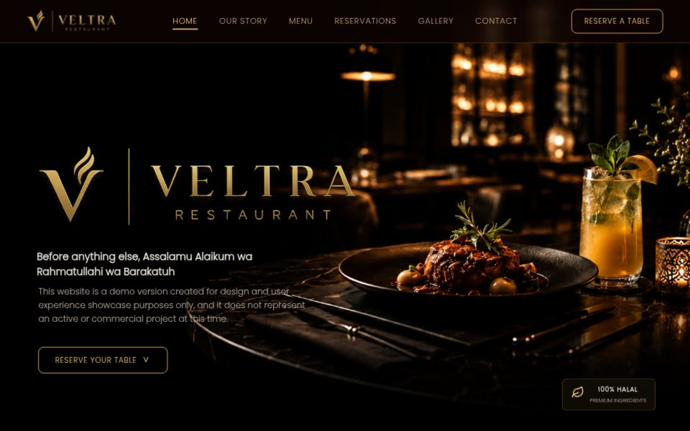

# 🌐 Veltra - Travel Website

A modern and fully responsive travel website designed to showcase stunning destinations around the world through a clean, elegant, and user-friendly interface.

🚀 **Live Demo:** https://veltra-xi.vercel.app/

---

## 📸 Preview



---

## 📌 About the Project

Veltra is a frontend travel website project focused on delivering a modern user experience, responsive layouts, and visually appealing destination sections.

The project was built to demonstrate frontend development skills using HTML, CSS, and JavaScript.

---

## ✨ Features

* Fully Responsive Design
* Modern & Clean User Interface
* Smooth Navigation Experience
* Mobile-Friendly Layout
* Fast Loading Performance
* Organized Code Structure

---

## 🛠️ Technologies Used

* HTML5
* CSS3
* JavaScript (Vanilla JS)
* Vercel (Deployment)

---

## 📁 Project Structure

```text
project-root/
├── assets/
├── css/
├── js/
├── index.html
└── README.md
```

---

## 🚀 Getting Started

### Clone the Repository

```bash
git clone https://github.com/your-username/your-repository.git
```

### Navigate to the Project Folder

```bash
cd your-repository
```

### Open the Project

Simply open `index.html` in your browser.

---

## 🔮 Future Improvements

* Booking System Integration
* User Authentication
* Backend Database Connection
* Search & Filtering Functionality
* SEO Optimization
* Dark Mode Support

---

## 👨‍💻 Author

**Hamza Haimeur**

GitHub: https://github.com/your-username

---

## 📄 License

This project is open-source and available for educational and portfolio purposes.
